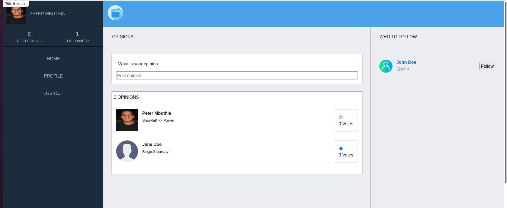
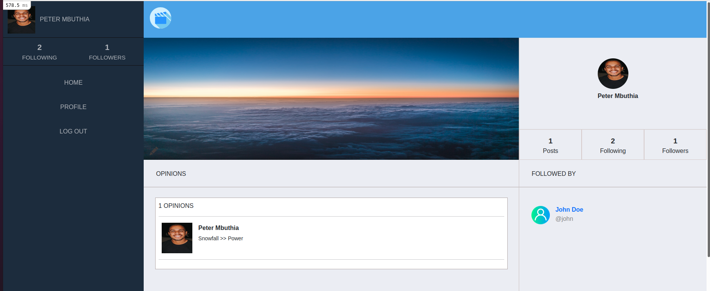

# Chatflicx
This is ruby on rails twitter redesign project which allows user to share their opinions on movies, or TV series that they enjoy. These opinions can either be upvoted or downvoted by other users.

Home page

Users' page

## Built With
- Ruby on Rails

## Live Demo
[Live link](https://secret-atoll-58969.herokuapp.com/)

## Getting Started
Clone this repository to get a copy of this project. 
- Open your terminal
- Run `git clone https://github.com/blakbox23/chatflicx.git`
- Open the project with your favorite code editor.
- Ensure Yarn packages are installed using `yarn install`
- Ensure the Gem files are also installed by running `bundle install`
- To setup your the database, run `db:create`, followed by `db:migrate`
- Finally to view the project, run `rails s`, and visit `http://localhost:3000/` from your browser.

## Author

👤 **Peter Mbuthia**

- GitHub: [@Blakbox23](https://github.com/blakbox23)
- Twitter: [@blakbox23](https://twitter.com/blakbox23)
- LinkedIn: [Peter Mbuthia](https://www.linkedin.com/in/peter-mbuthia)

## 🤝 Contributing
Contributions, issues, and feature requests are welcome.
Fell free to check the [issues page](https://github.com/blakbox23/chatflicx/issues)

## Acknowledgments
- Unsplash.com
- Flaticons.com

## Show your support
Give a ⭐ if you like this project.